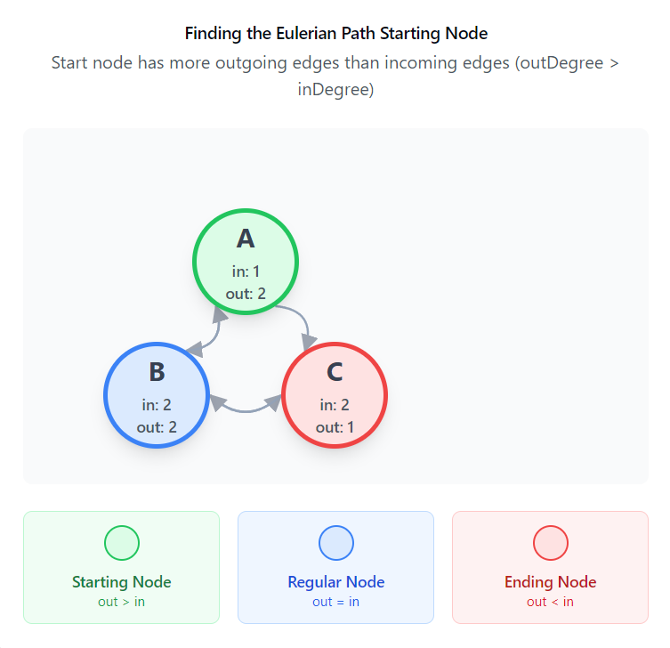

# Eulerian Path and Tour in Graphs

## Eulerian Path

An **Eulerian Path** is a path that uses every edge of a graph **exactly once** (vertices may be revisited)[1][2][3].

### Undirected Graphs

- Exists **if and only if**:
   - The graph is connected (ignoring vertices of degree 0)
   - **Exactly zero or two vertices** have an odd degree
   - If zero, a **tour (cycle)** also exists
   - If two, only a path (not a cycle) exists[1][2]

### Directed Graphs

- Exists **if and only if**:
   - The graph is strongly connected
   - **At most one vertex** has out-degree 1 greater than in-degree (start)
   - **At most one vertex** has in-degree 1 greater than out-degree (end)
   - All other vertices have equal in-degree and out-degree[3]

## Eulerian Tour (Cycle)

An **Eulerian Tour** (or Circuit) is an Eulerian path that starts and ends at the same vertex[1][2][3].

### Undirected Graphs

- Exists **if and only if**:
   - The graph is connected (ignoring vertices of degree 0)
   - **Every vertex** has **even degree**[1][3]

### Directed Graphs

- Exists **if and only if**:
   - The graph is strongly connected
   - **Every vertex** has **equal in-degree and out-degree**[3]

---

**Summary Table:**

| Graph Type   | Eulerian Path Exists When                 | Eulerian Tour Exists When                 |
|--------------|------------------------------------------|-------------------------------------------|
| Undirected   | Connected, 0 or 2 odd degree vertices [1] | Connected, all vertices even degree [1]   |
| Directed     | Strongly connected, specific in/out degree conditions [3] | Strongly connected, all vertices in-degree = out-degree [3] |

---

**References:**  
[1] GeeksforGeeks  
[2] Wikipedia  
[3] GTOI Book

