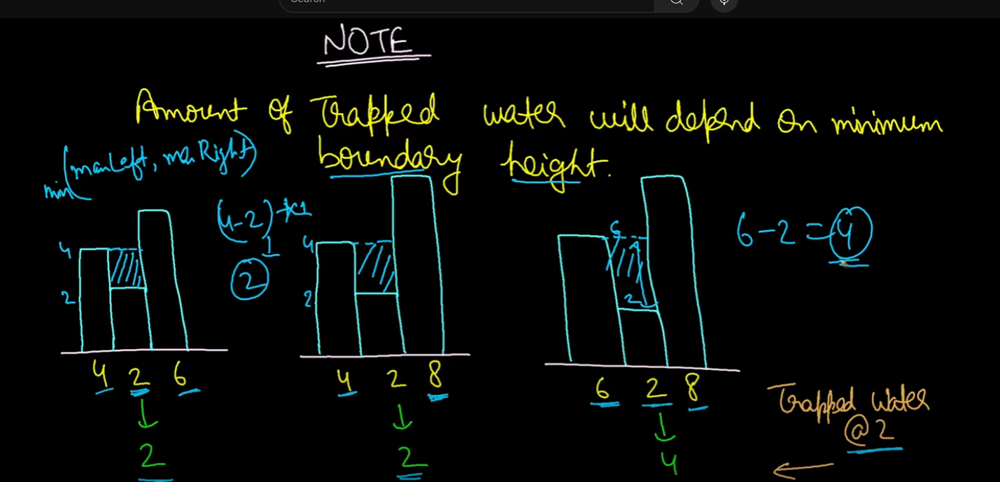

# [42. Trapping Rain Water](https://leetcode.com/problems/trapping-rain-water/description/)

The `trap` function calculates the amount of water that can be trapped between buildings represented by an array `height`, where each value in the array represents the height of a building at that position.

## Intuition-Monotonic Stack

Water can only be trapped between two buildings if they are taller than the building in between. The amount of water trapped above a building depends on the height of the tallest buildings to its left and right:
- The water level above the current building will be the smaller of these two heights, minus the current building's height.
- For water to accumulate above the current building, there must be taller buildings on both sides.

To find the total water trapped, we can iterate through each building, calculating the water trapped at that position based on the maximum heights to the left and right.

The maximum water trapped at any building depends on the tallest buildings to its left and right.
To calculate this, we use the formula: `min(leftMaxHeight, rightMaxHeight) - currentHeight`
This gives the water's height above the current building.
The width is the distance between the left and right boundaries, excluding the current building, calculated as `right - left - 1`.

To achieve this efficiently, as we traverse the height array from left to right, we maintain a stack that stores
the maximum height on the left side of the current building in a monotonic decreasing order.
This stack structure helps us quickly access the maximum height to the left, which is essential for the calculation.
Meanwhile, the right side max height can be determined directly based on the current building's processing.

### Ref: [Video Explanation](https://youtu.be/C8UjlJZsHBw)

### Approach

1. **Monotonic Stack**: Use a stack to store the indices of buildings in decreasing height order. This helps quickly identify the boundaries on the left side.
2. **Right Boundary**: As we iterate through the `height` array from left to right, each new building height becomes the right boundary for calculating trapped water over the previous buildings.
3. **Water Calculation**: When a building taller than the last "trapped" building is encountered:
    - Pop the trapped building from the stack.
    - Check if there’s another building on the left in the stack (left boundary).
    - If so, calculate the trapped water height as `min(left boundary, right boundary) - height of the current building`.
    - Calculate the width as the distance between the current right boundary and the left boundary, then multiply by height to get the volume of water.
4. **Push Current Index to Stack**: 
   - Push the current index to the stack.

### Complexity

- **Time Complexity**: `O(n)`, where `n` is the number of buildings. We iterate through each building once.
- **Space Complexity**: `O(n)`, for the stack used to store the indices.

## Intuition-Prefix Array
- A unit of water can only be trapped between two buildings if these buildings' heights are greater than the current building's height.
- The maximum amount of water that can be trapped at the current building depends on the maximum height of the buildings on the left and right sides.
- The maximum amount of water trapped at the current building would be `min(leftMaxHeight, rightMaxHeight) - currentHeight`. This will be the height of the trapped water.

Hence, We can notice that, the water trapped would be the min of leftMaxHeight and rightMaxHeight. Means for trapping water for this building if we know the 
leftMax and rightMax, then we can easily calculate the total water trapped. LeftMax and rightMax can be calculated using a prefix array

### Approach

1. **Initialize Arrays**:
   - Use two arrays `leftMax` and `rightMax` to store the maximum height to the left and right of each building, including itself.

2. **Fill LeftMax and RightMax**:
   - Traverse the height array from left to right to fill the `leftMax` array.
   - Traverse the height array from right to left to fill the `rightMax` array.

3. **Calculate Water Trapped**:
   - For each building (except the first and last), calculate the water trapped using the formula: `min(leftMax[i], rightMax[i]) - height[i]`.

4. **Sum Up the Water Trapped**:
   - Accumulate the water trapped for all buildings and return the total.

### Complexity

- **Time Complexity**: `O(n)`, where `n` is the number of buildings. We iterate through the height array multiple times.
- **Space Complexity**: `O(n)`, for the `leftMax` and `rightMax` arrays.

## Intuition-Two Pointers
If we know the maximum heights on the left (`leftMax`) and right (`rightMax`) of each building, we can calculate the water trapped at any given building. 
To find `leftMax`, we need the maximum height to the left of the current building `i`, and for `rightMax`, we need the maximum height to the right of `i`.

We can compute `leftMax` by scanning from `left to right` and `rightMax` by scanning from `right to lef`t`, then calculate the trapped water for building `i` at each step.

Using a two-pointer approach, one pointer starts from the `left` and the other from the `right`. 
This helps manage situations where `a taller` building exists on the `right`. Since we always take `min(leftMax, rightMax)`, if `height[left] < height[right]`, `leftMax` will determine the trapped water amount, as it’s always the minimum in this case.
The same applies for the right, if `height[right] < height[left]`, `rightMax` will determine the trapped water amount, as it’s always the minimum in this case.
Our formula, `min(leftMax, rightMax) - height[i]`, simplifies to `leftMax - height[i] if height[left] < height[right`] or `rightMax - height[i] if height[left] > height[right]`.

Ref: [Video](https://youtu.be/ZI2z5pq0TqA)

### Approach

1. **Initialize Pointers and Variables**:
   - `lb` (left boundary) starts from 0.
   - `rb` (right boundary) starts from `n - 1`.
   - `leftMax` to store the maximum height encountered from the left.
   - `rightMax` to store the maximum height encountered from the right.
   - `maxTrappedWater` to accumulate the total trapped water.

2. **Two-Pointer Technique**:
   - Iterate until `lb` is less than `rb`.
   - If the height at `lb` is less than the height at `rb`:
      - Update `leftMax` as the maximum of `leftMax` and `height[lb]`.
      - Add the trapped water at `lb` to `maxTrappedWater`.
      - Increment `lb`.
   - If the height at `rb` is less than or equal to the height at `lb`:
      - Update `rightMax` as the maximum of `rightMax` and `height[rb]`.
      - Add the trapped water at `rb` to `maxTrappedWater`.
      - Decrement `rb`.

3. **Return Result**:
   - Return the accumulated `maxTrappedWater`.

### Complexity

- **Time Complexity**: `O(n)`, where `n` is the number of buildings. We iterate through the height array once.
- **Space Complexity**: `O(1)`, as we use only a constant amount of extra space.

### Example Walkthrough

Consider the height array `height = [0, 1, 0, 2, 1, 0, 1, 3, 2, 1, 2, 1]`.

| Step | Left Boundary (`lb`) | Right Boundary (`rb`) | LeftMax | RightMax | Height[lb] | Height[rb] | Action and Calculation                                                                                           | Total Water Trapped |
|------|----------------------|----------------------|---------|----------|------------|------------|------------------------------------------------------------------------------------------------------------------|---------------------|
| Init | 0                    | 11                   | 0       | 0        | 0          | 1          | Initialize pointers and variables                                                                                | 0                   |
| 1    | 1                    | 11                   | 0       | 1        | 1          | 1          | Update `rightMax`, water trapped = 0                                                                             | 0                   |
| 2    | 1                    | 10                   | 0       | 2        | 1          | 2          | Update `rightMax`, water trapped = 0                                                                             | 0                   |
| 3    | 2                    | 10                   | 1       | 2        | 0          | 2          | Update `leftMax`, water trapped = 1                                                                              | 1                   |
| 4    | 3                    | 10                   | 2       | 2        | 2          | 2          | Update `leftMax`, water trapped = 0                                                                              | 1                   |
| 5    | 3                    | 9                    | 2       | 2        | 2          | 1          | Update `rightMax`, water trapped = 1                                                                             | 2                   |
| 6    | 4                    | 9                    | 2       | 2        | 1          | 1          | Update `leftMax`, water trapped = 1                                                                              | 3                   |
| 7    | 5                    | 9                    | 2       | 2        | 0          | 1          | Update `leftMax`, water trapped = 2                                                                              | 5                   |
| 8    | 6                    | 9                    | 2       | 2        | 1          | 1          | Update `leftMax`, water trapped = 1                                                                              | 6                   |
| 9    | 6                    | 8                    | 2       | 3        | 1          | 2          | Update `rightMax`, water trapped = 0                                                                             | 6                   |
| 10   | 7                    | 8                    | 2       | 3        | 3          | 2          | Update `leftMax`, water trapped = 0                                                                              | 6                   |
| 11   | 7                    | 7                    | 2       | 3        | 3          | 3          | Update `rightMax`, water trapped = 0                                                                             | 6                   |

The final total amount of trapped water is 6 units.
