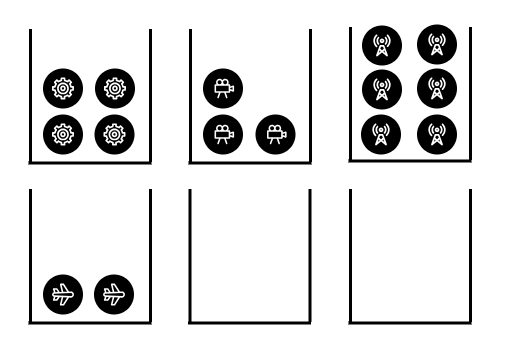
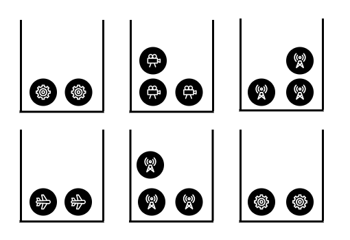

# [2064. Minimized Maximum of Products Distributed to Any Store](https://leetcode.com/problems/minimized-maximum-of-products-distributed-to-any-store/description/) 

## Overview
We are given an array `quantities` of length `m`, where `quantities[i]` represents the number of products of the i-th type, and an integer `n` denotes the number of stores. Our task is to distribute the products among the stores such that each store only receives products of a single type, and we minimize the maximum number of products received by any store.

For example, consider `n = 6` and `quantities = [4, 3, 6, 2]`. A simple distribution might assign each product type to a separate store, as shown in the following picture:

**Wrong Distribution of Products**
However, this leaves two stores unused, missing the opportunity to balance the load more effectively. A better strategy would be to distribute the products more evenly across all available stores as shown in the next picture, reducing the maximum number of products any store receives.

## Approach-BinarySearch
1. **Finding the Maximum Quantity**:
    - The `max` function iterates through the `quantities` array to find the maximum quantity of any product type.

2. **Binary Search for Minimized Maximum**:
    - Initialize `low` to 0 and `high` to the maximum quantity found.
    - Use binary search to find the minimized maximum number of products that can be placed in any store.
    - For each mid value, check if it is possible to distribute the products such that no store has more than `mid` products using the `isPossibleToDistribute` function.
    - Adjust the search range based on whether the distribution is possible.

3. **Checking Distribution Feasibility**:
    - The `isPossibleToDistribute` function checks if it is possible to distribute the products such that no store has more than `x` products.
    - It iterates through the stores and tries to place `x` products in each store, adjusting the remaining quantity accordingly.

## Complexity Analysis
- **Time Complexity**:
    - The `max` function runs in O(m) time, where `m` is the length of the `quantities` array.
    - The binary search runs in O(log(max(quantities))) iterations.
    - Each iteration of the binary search calls `isPossibleToDistribute`, which runs in O(n) time, where `n` is the number of stores.
    - Overall, the time complexity is O(m + n * log(max(quantities))).

- **Space Complexity**:
    - The space complexity is O(1) as we are using a constant amount of extra space.

## Approach 2: Greedy Approach Using a Heap

### Intuition
The key idea of this approach is to assign stores to product types in an optimal way, rather than assigning products to stores. Initially, each product type is assigned one store, which is guaranteed by the constraint `m ≤ n`. After this, we focus on which product types should receive additional stores. The algorithm greedily selects the product type `i` with the highest ratio of `quantity[i]` to `assigned_stores[i]`, assigning the next available store to that product type.

Since we need to repeatedly access the product type with the highest ratio and update the ratios as stores are assigned, a priority queue (max-heap) is useful for efficiently managing these operations.

### Proof of Correctness
Consider an arbitrary distribution of stores to products, represented as `[s0, s1, s2, ..., sm-1]`, where `si` denotes the number of stores assigned to the i-th product type. The specific indices of stores assigned or the order of assignment don’t affect the result.

To minimize the load on any single store, the products of type `i` should be distributed as evenly as possible across its `si` assigned stores. This ensures that each store handling products of type `i` will have no more than `⌈quantities_i / si⌉` products.

Thus, our objective is to minimize the maximum number of products any store receives. The function should return:

$$
f(i) = \max_{i \in [0, m-1]} \lceil \frac{quantities_i}{s_i} \rceil
$$

Now, consider the greedy approach: If at any point in the algorithm, we fail to assign the next available store to the product type with the highest ratio `quantity[i]` to `assigned_stores[i]`, that ratio will remain the largest, leading to a non-optimal distribution. This would cause the highest ratio to dominate, violating our goal of minimizing the maximum number of products per store.

To gain a better understanding of the algorithm, let’s revisit our initial example with `n = 6` and `quantities = [4, 3, 6, 2]`.

### Algorithm
1. Create an array of pairs, `typeStorePairsArray`, to store pairs of integers, where each pair represents the total quantity of a product type and the number of stores currently assigned to it. This array will help us initialize efficiently the priority queue.
2. Initialize a priority queue (max-heap) named `typeStorePairs`, using `typeStorePairsArray`, that sorts its elements by the ratio of their first to their second value.
3. Loop with `i` ranging from `0` to `n - m - 1`:
    - Pop the element with the highest ratio from the priority queue, denoted as `pairWithMaxRatio = [totalQuantityOfType, storesAssignedToType]`.
    - Push the element back into the heap, now assigning it an additional store: push `[totalQuantityOfType, storesAssignedToType + 1]`.
4. After the loop, pop the element with the highest ratio again, denoted as `pairWithMaxRatio = [totalQuantityOfType, storesAssignedToType]`.
5. Finally, return `ceil(totalQuantityOfType / storesAssignedToType)`.

### Time Complexity: O(m + (n−m) log m)

1. We first iterate over the `quantities` array, pushing each value as the first element of a pair into the helper array. This operation takes O(m) time.
2. We then initialize a priority queue (heap) using the elements from the array. Building the heap takes O(m) time because heapify is performed in linear time.
3. After that, we enter a second loop that runs `n−m` times. In each iteration, we perform one pop and one push operation on the priority queue. Both operations take O(log m) time, so this loop has a total time complexity of O((n−m) log m).

Combining the time complexities of the initialization, heap construction, and store allocation, the overall time complexity of the algorithm is: O(m + (n−m) log m).

### Space Complexity: O(m)

The priority queue has a size of `m` since each value of the `quantities` array is inserted as the first element of exactly one `typeSortPair`.