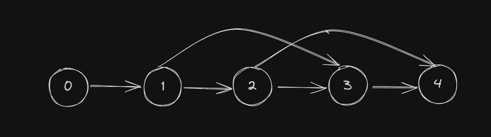

# [ 3244. Shortest Distance After Road Addition Queries II](https://leetcode.com/problems/shortest-distance-after-road-addition-queries-ii/description/)

[Video](https://youtu.be/NWMSeuA6V-0)

## Intuition-HashMap[TLE]

The problem can be visualized as a dynamic graph problem where cities are nodes and roads are edges. Each query adds a
new road to the graph, and our task is to find the shortest path from the starting city (node `0`) to the destination
city (node `n-1`) after each query. To achieve this efficiently, we use a HashMap to represent the graph and dynamically
update it as new edges are added.

This is similar to the problem [ShortestDistanceAfterRoadAdditionQueriesI_3243], the only difference being that for any
two queries at `i` and `j` indices:

`queries[i][0] < queries[j][0] < queries[i][1] < queries[j][1]`

This means they are in sorted order and never overlap with each other.

### Example:

Given the queries:  
`{2, 4}, {0, 2}, {0, 4}`

If you sort them:  
`{0, 2}, {0, 4}, {2, 4}`

There is no path that overlaps or intersects with any other path.

### Counter Example:

Given the queries:  
`{1, 3}, {2, 4}`

In this case:

- There is a path from `1` to `3`.
- There is a path from `2` to `4`.  
  The path `{2, 4}` overlaps with `{1, 3}` because `2` comes in between.

If there are no overlapping or intersecting paths we can get rid of nodes in between path as it is guarnteed that no
useful path will originate from the nodes we remove

## Approach

1. **Graph Initialization**:
    - Use a `HashMap` named `adjListMap` to represent the graph.
    - Initialize the graph with the default road from each node `i` to node `i+1`.

2. **Processing Queries**:
    - For each query, extract the nodes `u` and `v`.
    - Remove all edges from nodes between `u+1` and `v-1` as they become redundant due to the new direct path from `u`
      to `v`.
    - Add the new edge from `u` to `v` to the `adjListMap`.
    - The size of the `adjListMap` represents the shortest path length because it includes only the necessary nodes to
      reach the destination.

3. **Return Result**:
    - Return the result array containing the shortest path lengths after each query.

## Complexity Analysis

### Time Complexity

1. **Graph Initialization**:
    - Initializing the `HashMap` for `n` nodes takes `O(n)` time.
    - Adding initial edges from node `i` to node `i+1` takes `O(n)` time.

2. **Processing Queries**:
    - For each query, removing edges between nodes `u+1` and `v-1` takes `O(v - u)`, where `v` and `u` are the indices
      in the query.
    - Adding the new edge from `u` to `v` takes `O(1)` time.
    - Given `Q` queries, the overall time complexity becomes `O(Q * (v - u))` in the worst case.

Thus, the overall time complexity is `O(n + Q * (v - u))`.

### Space Complexity

1. **Graph Storage**:
    - The `HashMap` requires `O(E)` space, where `E` is the number of edges.
    - Initially, there are `n-1` edges, so the space required is `O(n)`.

Thus, the overall space complexity is `O(n)`.

## Intuition-HashMap Optimized

The main problem in the above solution is removing the nodes in between `[u, v]`. Each time we run a loop through these
nodes, we fail to consider the possibility that a previous query might have already removed some nodes in
between `[u, v]`.

### Example:

1. Assume a query `[5, 10]`.
    - The first time, we remove nodes `6, 7, 8, 9`.

2. Now consider another query `[0, 11]`.
    - We attempt to remove nodes `1, 2, 3, 4, 5, 6, 7, 8, 9, 10`.

However, during the first query, nodes `6, 7, 8, 9` were already removed.  
The valid candidates from the second query are `1, 2, 3, 4, 5, 10`, but the loop still runs for all nodes, leading to
inefficiency.

### Problem:

This inefficiency can cause a **Time Limit Exceeded (TLE)** error.  
In the worst case:

- The first query might remove all nodes from `0` to `n-1`.
- All later queries would fall within the range `(0, n-1)`.

### Solution:

To avoid this, we can optimize the process by identifying the exact range that needs to be removed. And remove those
nodes that are left between the range.

# Intuition

The problem involves efficiently determining the shortest path distance after processing each query, where each query
removes a specific range of nodes. The intuition is to maintain a map of valid connections (`adjListMap`) that represent
the current state of the graph, dynamically updating it as nodes are removed. Instead of repeatedly recalculating from
scratch, we maintain only the necessary nodes and edges.

# Approach

1. **Initialize Adjacency List Map:**
    - Create a map (`adjListMap`) representing the default road graph, where each node connects to the
      next (`i -> i+1`).

2. **Process Each Query:**
    - For a query `[u, v]`:
        - **Skip if Already Removed:** If the starting node `u` has already been removed or there's a better edge
          from `u`, the size of the map (number of nodes still connected) is recorded as the result.
        - **Remove Overlapping Edges:** Traverse and remove edges in the range `[u, v]` by following the map's
          connections.
        - **Update Map:** After removing the range, connect `u` to `v` to maintain the graph's structure.

3. **Record Result:** After processing the query, the size of the map reflects the shortest path, as it corresponds to
   the number of valid nodes required to traverse the graph.

# Complexity Analysis

1. **Time Complexity:**
    - **Map Initialization:** `O(n)` to construct the initial map.
    - **Query Processing:** Each query removes a subset of edges, and the total number of edges removed across all
      queries is at most `O(n)`. Therefore, processing all queries takes `O(n)` in total.
    - **Overall Time Complexity:** `O(n + q)`, where `q` is the number of queries.

2. **Space Complexity:**
    - The adjacency list map stores at most `O(n)` edges.
    - The result array requires `O(n=q)` space.
    - **Overall Space Complexity:** `O(n + q)`.

# Example Walkthrough

- **Initial Map:**  
  For `n = 5`: `{0 -> 1, 1 -> 2, 2 -> 3, 3 -> 4}`.

- **Query `[1, 3]`:**
    - Remove edges between `1` and `3`: `{1 -> 2, 2 -> 3}`.
    - Update map: `{0 -> 1, 1 -> 3, 3 -> 4}`.
    - Result: `size = 3`.

- **Query `[0, 4]`:**
    - Remove edges between `0` and `4`: `{0 -> 1, 1 -> 3, 3 -> 4}`.
    - Update map: `{0 -> 4}`.
    - Result: `size = 1`.

- Final result: `[3, 1]`.

# Key Insights

- The approach avoids recalculating paths by dynamically maintaining a minimal representation of the graph.
- The use of a map ensures efficient updates and lookups, critical for handling overlapping queries without redundant
  computations.

## Intuition-MaintainDistance

# Intuition

This solution focuses on reducing the shortest path dynamically as queries are processed. Instead of maintaining a map,
it uses a direct array (`next`) to represent the adjacency relationships between nodes, thereby making updates and
lookups faster and more memory-efficient.

The key idea is to dynamically skip over unnecessary nodes in the range `[u, v]` for each query, effectively "
compressing" the graph representation.

# Approach

1. **Initialize Adjacency Array:**
    - Create an array `next` where `next[i] = i + 1`. This represents the default graph structure, with each node
      pointing to the next.

2. **Process Each Query:**
    - For a query `[u, v]`:
        - Traverse the range `[u, v]` using the `next` array.
        - For each node in the range:
            - Update `next[u]` to point directly to `v`.
            - Cache the current edge to move forward in the range.
            - Decrement the `distance` counter, as these nodes are effectively removed from the path.

3. **Record Result:**
    - After processing the query, the remaining `distance` (number of active edges) is recorded.

4. **Return Results:**
    - The result array contains the shortest path length after each query.

# Complexity Analysis

1. **Time Complexity:**
    - **Array Initialization:** \(O(n)\) to set up the `next` array.
    - **Query Processing:** Each edge is updated at most once across all queries, leading to a total complexity of \(O(
      n)\).
    - **Overall Time Complexity:** \(O(n + q)\), where \(q\) is the number of queries.

2. **Space Complexity:**
    - **Adjacency Array:** \(O(n)\) space for the `next` array.
    - **Result Array:** \(O(q)\) space for the result.
    - **Overall Space Complexity:** \(O(n + q)\).

# Example Walkthrough

### Input:

- \(n = 5\), `queries = [[1, 3], [0, 4]]`.

### Step-by-Step Execution:

1. **Initialization:**
    - `next = [1, 2, 3, 4, 5]` (default adjacency array).
    - `distance = 4` (initial edges count).

2. **Query `[1, 3]`:**
    - Traverse `1 -> 2 -> 3`:
        - Update `next[1] = 3`.
        - Remove nodes `2` (edge `[1, 2]` removed), decrement `distance` to `3`.
    - Result after query: `distance = 3`.

3. **Query `[0, 4]`:**
    - Traverse `0 -> 1 -> 3 -> 4`:
        - Update `next[0] = 4`.
        - Remove nodes `1, 3` (edges `[0, 1]` and `[3, 4]` removed), decrement `distance` to `1`.
    - Result after query: `distance = 1`.

4. **Final Output:**
    - `result = [3, 1]`.

# Key Insights

- The use of the `next` array eliminates the need for map structures, simplifying the implementation.
- The solution efficiently avoids redundant computations by ensuring that each node is updated only once across all
  queries.
- This approach is particularly well-suited for handling large inputs due to its linear complexity.
