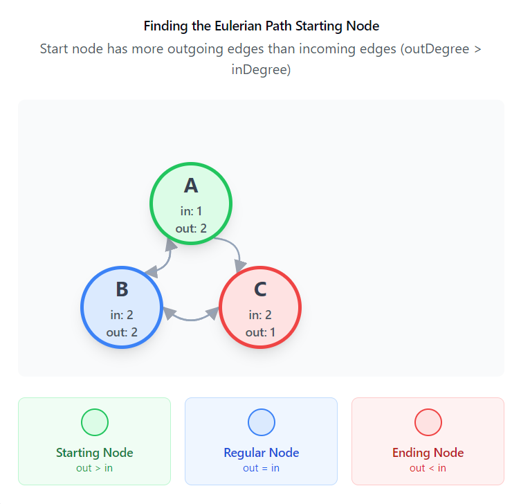

# [2097. Valid Arrangement of Pairs](https://leetcode.com/problems/valid-arrangement-of-pairs/description)

# Overview

We're given a list of pairs, each represented as `[start, end]`, and our task is to arrange these pairs in a specific
order. For this order to be valid, the end of each pair has to match the start of the next one in line. Thankfully, we
know that a valid arrangement is guaranteed to exist.

To put it more technically:

1. For every pair in the sequence, the end of the pair at index `i-1` has to equal the start of the pair at index `i`.
2. If there’s more than one possible arrangement, we only need to return one of them.

To solve this, we can borrow ideas from Eulerian paths. The basic idea is that an Eulerian path in a graph visits every
edge exactly once, which is similar to our goal where each pair’s end needs to connect smoothly (`end[i-1] == start[i]`)
to the start of the next pair.

## The Rules of Eulerian Path

Eulerian paths have a couple of conditions:

1. In an undirected graph, either all nodes have an even degree, or exactly two have an odd degree.
2. In a directed graph (which is what we have here), we need to check if:
    - Each node’s outDegree matches its inDegree.
    - Or, exactly one node has one more outgoing edge (`outDegree = inDegree + 1`), which indicates our starting point.

Given the problem's guarantee of a valid arrangement, we can rely on these properties. So, all we need to do is find
that starting node, then follow the edges to build our path.

# Approach 1: Eulerian Path (Recursive) [Solution_EulerianCircuit]

## Intuition

Before finding the starting node, we treat each pair as a directed edge between two nodes, where the start is the
beginning node and the end is the destination. Using this setup, we can create a graph representation with an adjacency
list, where each node points to the nodes it connects to directly. This list of neighbors for each node will help us
keep track of the possible paths we can take as we form the sequence of pairs.

The next step is finding the right starting node for our traversal. We’re looking for a node where the outgoing edges (
or outDegree) exceed the incoming edges (or inDegree) by one. Such a node, if it exists, serves as a natural starting
point because it has one extra outgoing connection that begins the path. If there’s no node like this (meaning all nodes
have equal in and out degrees), then any node can be chosen as the start, as this suggests a closed Eulerian path.

With our starting node identified, we can traverse the graph using Depth-First Search (Postorder DFS). Starting from our
chosen node, we follow each edge, moving to neighboring nodes and adding each visited node to our path. This way, we
ensure that every edge is visited exactly once, creating a continuous sequence that meets the required conditions. As we
explore each edge, we add nodes to the path in the reverse order (because of DFS), which means we’ll need to reverse the
recorded path at the end to obtain the correct order.

At this point, you might wonder why we need to use postorder DFS. The intuitive approach is to use a DFS with
backtracking, which would also work but would likely lead to a Time Limit Exceeded (TLE) issue. The time complexity of a
basic DFS with backtracking is $O(N \cdot E)$, where $N$ is the number of nodes and $E$ is the number of edges. This
approach is too slow because we may end up revisiting nodes or edges multiple times.

The key to optimizing this is to use postorder DFS, which runs in $O(N + E)$ time. The reason postorder DFS works well
for this problem is that:

- We need to perform a DFS traversal to visit every edge exactly once, and since we are guaranteed an Eulerian path, we
  know that all edges/pairs will be visited starting from the correct start node.
- The crucial part is that we need to ensure that all edges starting from a given node are visited before we append that
  node to the path. In postorder DFS, we first explore all the neighbors (edges) of a node and only append the node to
  the path after all its edges have been processed. This guarantees that we follow the correct sequence, ensuring that
  the traversal respects the rule of visiting all edges from the current node before moving on.
- Another way to explain why we use postorder DFS is that when we are at a node `u` with multiple unvisited outgoing
  edges, we know we will need to return to `u` later in the tour to complete the Eulerian path. However, not all
  outgoing edges will lead back to `u`. To handle this, we perform a postorder traversal instead of a preorder
  traversal, ensuring that we visit all outgoing edges before returning to the node.

Thus, postorder DFS effectively reduces unnecessary work, avoids TLE, and provides the optimal solutionBinarySearch. If you're still
unsure about the approach, it may be helpful to look at problem 332. Reconstruct Itinerary, which involves a similar
solutionBinarySearch and approach.

Finally, with our ordered path in hand, we construct the final result by pairing each consecutive node in the path
as `[start, end]` pairs.

## Algorithm

1. **Graph Construction**:
    - Initialize `adjacencyMatrix` as an unordered map of deques to represent the graph (adjacency list).
    - Initialize `inDegree` and `outDegree` to track the in-degrees and out-degrees of each node.
    - For each pair in `pairs`:
        - Extract the start and end values from the pair.
        - Add `end` to the adjacency list of `start` in `adjacencyMatrix`.
        - Increment `outDegree[start]` and `inDegree[end]`.

2. **DFS Traversal**:
    - Define a helper function `visit(int node)` for DFS traversal:
        - While there are outgoing edges from the current node (`node`):
            - Pop the next node from the adjacency list and recursively call `visit` on it.
        - After visiting all outgoing nodes, add the current node to `result`.

3. **Starting Node**:
    - Find the starting node for the DFS:
        - Search for a node `startNode` where the out-degree is exactly one greater than the
          in-degree (`outDegree[node] == inDegree[node] + 1`).
        - If no such node exists, use the first element of the first pair as the starting node.

4. **Perform DFS**:
    - Call `visit(startNode)` to perform the traversal and fill the result array with the nodes in reverse order.
    - Reverse the result array to restore the correct order of nodes.

5. **Construct Result**:
    - For each consecutive pair of nodes in `result`, add a pair `[result[i-1], result[i]]` to `pairedResult`.
    - Return `pairedResult`, which represents the valid arrangement of the input pairs.

## Complexity Analysis

### Time Complexity

- **Graph Construction**:
    - Constructing the graph takes `$O(E)$` time, where `$E$` is the number of edges (pairs).
- **DFS Traversal**:
    - Calculating the in-degree and out-degree takes `$O(V + E)$`, where $V$ is the number of nodes.
    - Constructing the Eulerian path takes `$O(V + E)$` time as it involves a depth-first search.
    - Thus, the overall time complexity is `$O(V + E)$`.

### Space Complexity

- **Graph Storage**:
    - The space required to store the graph is `$O(V + E)$`.
- **DFS Storage**:
    - The stack used for the depth-first search requires `$O(V)$` space.
    - Therefore, the overall space complexity is `$O(V + E)$`.

# Approach 2: Hierholzer's Algorithm (Iterative) [Solution_HierholzerIterative]

## Intuition

To solve the problem, iteratively, we follow the same core logic used in the recursive solutionBinarySearch but avoid recursion by
using a stack for DFS. The key concept stays the same: we start by creating an adjacency list, then find the starting
node, and after that, proceed with iterative DFS.

The idea is to use a stack to manage our current position in the graph. Starting from the identified starting node, we
push the node onto the stack. At each step, we check if the current node has any outgoing edges left (i.e., if the
adjacency list for that node is non-empty). If it does, we push the next node (taken from the front of the adjacency
list) onto the stack. This continues until there are no more outgoing edges to visit from the current node.

If a node has no more outgoing edges, it means we’ve fully explored all edges from that node, so we pop it off the stack
and add it to the result list. Since we’re collecting the nodes in reverse order (because we process the last node of
each pair first), we need to reverse the result list at the end to get the correct order for the Eulerian path.

Finally, we construct the solutionBinarySearch by pairing consecutive nodes in the reversed path. This gives us the correct sequence
of pairs where each pair’s end connects to the next pair’s start.

This algorithm is famously known as Hierholzer's algorithm, named after the German mathematician Carl Hierholzer.

## Algorithm

1. **Graph Construction**:
    - Initialize `adjacencyMatrix` as an unordered map of deques to represent the graph (adjacency list).
    - Initialize `inDegree` and `outDegree` to track the in-degrees and out-degrees of each node.
    - For each pair in `pairs`:
        - Add the edge to the adjacency list (`adjacencyMatrix[start]`).
        - Increment the outDegree of the start node.
        - Increment the inDegree of the end node.

2. **Determine Start Node**:
    - Initialize `startNode` to `-1` to store the node from where the traversal should begin.
    - For each node in `outDegree`:
        - Check if the outDegree is one greater than the inDegree (i.e., `outDegree[node] == inDegree[node] + 1`):
            - If so, set `startNode` to this node and break the loop.
        - If no such `startNode` is found (i.e., no node with outDegree greater than inDegree by 1), set `startNode` to
          the first element of the first pair in `pairs`.

3. **Perform Iterative DFS**:
    - Initialize `nodeStack` and push `startNode` onto the stack for DFS traversal.
    - While `nodeStack` is not empty:
        - Get the top node from the stack.
        - If the top node has outgoing edges in `adjacencyMatrix`, push the next node onto the stack.
        - If there are no outgoing edges left for the top node, add it to the result list and pop it from the stack.

4. **Reverse Result**:
    - Reverse the result since nodes were added in reverse order during DFS.

5. **Construct Result**:
    - For each consecutive pair of nodes in `result`, create a new pair (`result[i-1], result[i]`) and add it
      to `pairedResult`.
    - Return `pairedResult` as the final answer, representing the valid arrangement of pairs.

## Complexity Analysis

### Time Complexity

- **Graph Construction**:
    - Constructing the graph takes `O(E)` time, where `E` is the number of edges (pairs).
- **DFS Traversal**:
    - Performing the iterative DFS takes `O(V + E)`, where `V` is the number of nodes.
    - Thus, the overall time complexity is `O(V + E)`.

### Space Complexity

- **Graph Storage**:
    - The space required to store the graph is `O(V + E)`.
- **DFS Storage**:
    - The stack used for the depth-first search requires `O(V)` space.
    - Therefore, the overall space complexity is `O(V + E)`.
