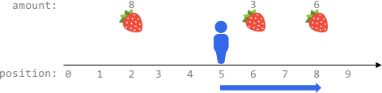
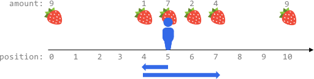
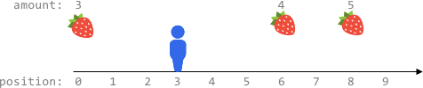
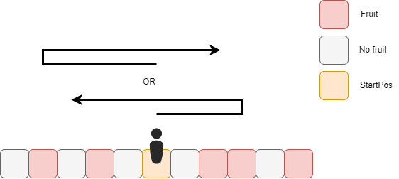
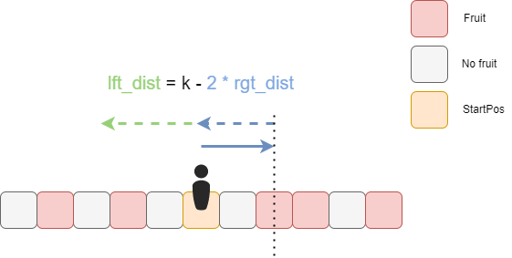
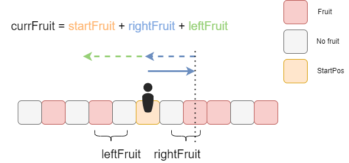
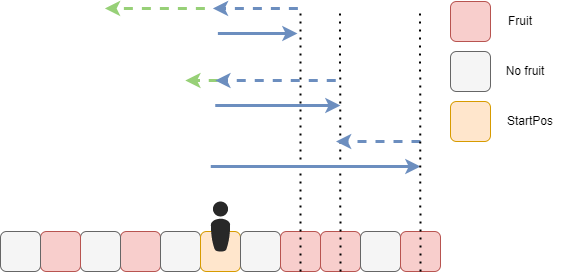

# Maximum Total Fruits Harvested

This problem asks us to find the maximum number of fruits we can harvest within a given number of steps (`k`) starting from a given position (`startPos`) on an infinite x-axis where fruits are located at specific sorted positions.



**Key Observations:**

1.  We can travel up to `k` steps to the left from `startPos` and harvest all fruits encountered.
2.  We can travel up to `k` steps to the right from `startPos` and harvest all fruits encountered.
3.  We can travel `X` steps to the left (`0 <= X <= k`) and then `k - 2*X` steps to the right (or vice-versa), harvesting fruits along the way. The `2*X` accounts for the steps taken to go left and return to a position from where we can move right.
4.  Since the fruit positions are sorted, we can leverage this property to efficiently explore reachable ranges.








**Understanding the Distance and Steps:**

For a given range of fruits between a `leftPos` and a `rightPos` (where `leftPos <= rightPos` in terms of their x-coordinates), and our starting position `startPos`, 
the total steps taken to harvest all fruits in this range can be calculated in two primary ways:

- Option 1:  Go from `startPos` to `leftPos` and then to `rightPos`: `abs(startPos - leftPos) + (rightPos - leftPos)`
- Option 2:  Go from `startPos` to `rightPos` and then to `leftPos`: `abs(startPos - rightPos) + (rightPos - leftPos)`
We choose the smaller of the two because we want to minimize the total number of steps used.
Hence, the minimum of these two represents the most efficient way to harvest all fruits within the `[leftPos, rightPos]` range.


**Algorithm using a Sliding Window:**

We can use a sliding window approach to efficiently find the maximum number of fruits we can harvest. The window will represent a contiguous range of fruit locations in the sorted `fruits` array.

1.  **Initialize:**
    * `maxHarvest = 0` to store the maximum number of fruits harvested.
    * `left = 0` as the left boundary of the window (index in `fruits`).
    * `currentHarvest = 0` to track the number of fruits in the current window.

2.  **Iterate with the Right Pointer:**
    * Iterate through the `fruits` array with a `right` pointer (from `0` to `n-1`, where `n` is the number of fruit locations).
    * For each `right` position, add the number of fruits at `fruits[right]` to `currentHarvest`.

3.  **Maintain the Window Size (within `k` steps):**
    * While the total steps required to harvest all fruits within the current window `[left, right]` (considering reaching the leftmost or rightmost fruit from `startPos` and then traversing the window) exceeds `k`:
        * Subtract the fruits at `fruits[left]` from `currentHarvest`.
        * Increment the `left` pointer to shrink the window from the left.

    * The condition to check if the window is within `k` steps is:
        ```
        min(abs(startPos - fruits[left][0]), abs(startPos - fruits[right][0])) + (fruits[right][0] - fruits[left][0]) > k
        ```
      If this condition is true, we need to shrink the window from the left.

4.  **Update `maxHarvest`:**
    * In each iteration of the `right` pointer (after potentially shrinking the window), update `maxHarvest` with the maximum of its current value and `currentHarvest`.

5.  **Return `maxHarvest`:**
    * After iterating through all possible right endpoints, `maxHarvest` will contain the maximum total number of fruits that can be harvested within `k` steps.
