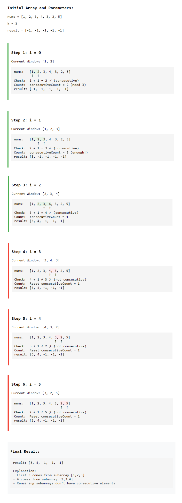

# [3254. Find the Power of K-Size Subarrays I](ttps://leetcode.com/problems/find-the-power-of-k-size-subarrays-i/description)

# Approach 1: Sliding Window with Deque

## Intuition
For a more efficient approach, we can use the sliding window technique to avoid rechecking the entire subarray from scratch each time we move the window.

We use a deque to store the indices of elements in the valid sequence. We'll maintain a window of size `k` to slide through the array, focusing on two aspects: keeping track of the current valid window, and ensuring the consecutive property holds.

As we move to a new element, we first check if it breaks the consecutive sequence with the last inserted element in the deque. If it does, we invalidate the entire window and clear the deque. Otherwise, we add the current element’s index to the deque.

When our window size reaches `k`, we examine the size of the deque. If the deque contains exactly `k` indices, we conclude that we have a valid subarray, and we can retrieve the maximum element efficiently from the end of the deque. If the deque does not have `k` elements, we set the result for that position to `-1`.

## Algorithm
1. Initialize `length` to the size of the `nums` array and `result` array of size `length - k + 1`.
2. Create a deque `indexDeque` to store indices within the sliding window.
3. Loop through each index `currentIndex` in `nums`:
    - If `indexDeque` is not empty and the index at the front of `indexDeque` is out of the window range, remove it to maintain the sliding window size.
    - If `indexDeque` is not empty and `nums[currentIndex]` does not follow the consecutive and sorted condition (i.e., `nums[currentIndex]` is not `nums[currentIndex - 1] + 1`), clear `indexDeque` as the current sequence is invalid.
    - Add `currentIndex` to the end of `indexDeque`.
    - If `currentIndex` has reached at least `k - 1` (a window has a full size of `k`):
        - If `indexDeque` contains exactly `k` elements, set `result[currentIndex - k + 1]` to the value at `nums[indexDeque.peekLast()]` since the window is valid.
        - Otherwise, set `result[currentIndex - k + 1]` to `-1` as it indicates an invalid window.
4. Return `result`, where indices with valid sequences contain the last element of the sequence, and others remain `-1`.

## Complexity Analysis

* Time complexity: `O(n)` where `n` is the length of the input array `nums`.
* Space complexity: `O(n)` where `n` is the length of the input array `nums`.

# Approach 3: Optimized Via Counter

## Intuition
In the previous approach, we used a deque to track a sequence of size `k` and check if each new element is consecutive with the last element added to the deque. However, this raises an important question: why use a deque at all if we’re only interested in checking whether the current element follows directly from the last one we examined?

This leads us to a simpler approach: we can replace the deque with a simple counter that tracks the length of the consecutive sequence. As we go through the array, we check each element with the one that follows it. If they are consecutive, we increase our counter. Otherwise, we reset the counter to `1` since the sequence is broken.

When our counter reaches `k`, it signals that we’ve found a valid subarray of size `k`. At this point, we store the last element of this sequence as the result. For any indices that don’t meet the consecutive condition, we set their result to `-1`.

## Description
The `resultsArray` method determines the last element of valid consecutive subarrays of length `k` in the input array `nums`. If no valid subarray exists for a particular position, the result is `-1`.

## Algorithm
1. **Initialize variables**:
    - Set `consecutiveCount` to `1` to track the length of the current consecutive sequence.
    - Let `n` be the length of the input array `nums`.
    - Create an array `output` of size `n - k + 1` to store results.

2. **Iterate through the input array `nums`**:
    - For each index `i` from `0` to `n - 1`:
        - **Check for consecutive elements**:
            - If `i > 0` and `nums[i] == nums[i - 1] + 1`, increment `consecutiveCount`.
            - Otherwise, reset `consecutiveCount` to `1`.
        - **Handle valid subarray positions**:
            - If `i - k + 1 >= 0` (ensuring the sliding window of size `k` has started):
                - Initialize `maxEle` to `-1`.
                - If `consecutiveCount >= k`:
                    - Set `maxEle` to `nums[i]`, as it is the last element of the valid sequence.
                - Assign `maxEle` to `output[i - k + 1]`.

3. **Return the result**:
    - Return the `output` array, where each index contains the last element of a valid consecutive subarray, or `-1` if no such subarray exists.

## Complexity Analysis

* Time complexity: `O(n)` where `n` is the length of the input array `nums`.
* Space complexity: `O(1)` 